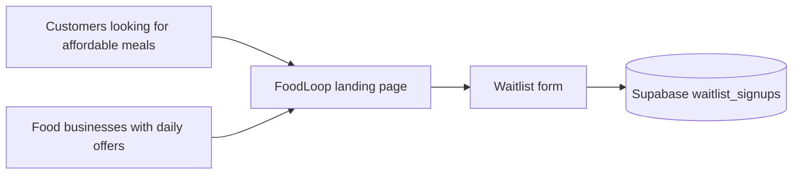
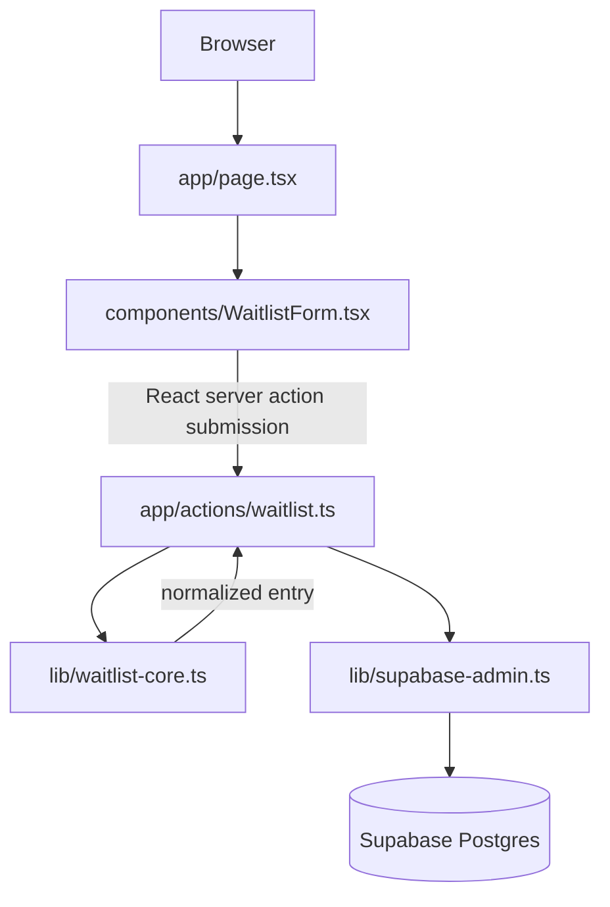

# FoodLoop

FoodLoop is a Georgian-language Next.js landing page, waitlist experience, and protected admin email view for a neighborhood food marketplace. The page introduces the product, uses a visual market-sheet art direction, and stores early user and partner interest in Supabase.


## What This Repo Contains

| Area | Purpose |
| --- | --- |
| [`app/`](./app/README.md) | Next.js App Router routes, metadata, global styling, and the waitlist server action. |
| [`components/`](./components/README.md) | Reusable React components, including the waitlist form and local UI primitives. |
| [`lib/`](./lib/README.md) | Framework-light business logic, Supabase client setup, and shared utilities. |
| [`supabase/`](./supabase/README.md) | Database migration for the waitlist table and security posture. |
| [`tests/`](./tests/README.md) | Node test coverage for waitlist validation and insert-state handling. |
| [`public/`](./public/README.md) | Product imagery and UI concept assets used by the landing page and docs. |
| [`openspec/`](./openspec/README.md) | Product/change proposals, design notes, specs, and implementation tasks. |
| [`docs/`](./docs/README.md) | Cross-cutting architecture, development, testing, and operations guides. |

## Product Snapshot

FoodLoop connects nearby customers with cafes, bakeries, restaurants, and markets that have affordable surplus meals or daily offers. The current app is intentionally narrow: it validates and stores waitlist signups while presenting the first product story.



## Runtime Architecture



The UI is split from the waitlist business rules. `WaitlistForm` owns the browser interaction, `joinWaitlist` owns the server boundary, and `submitWaitlistForm` owns validation/result mapping so it can be tested without a live Supabase project.

## Quick Start

1. Install dependencies:

   ```bash
   npm install
   ```

2. Create a local environment file from the example:

   ```bash
   cp .env.example .env.local
   ```

3. Fill in:

   ```env
   NEXT_PUBLIC_SUPABASE_URL=...
   NEXT_PUBLIC_SUPABASE_PUBLISHABLE_KEY=...
   SUPABASE_SERVICE_ROLE_KEY=...
   ADMIN_EMAILS=owner@example.com,ops@example.com
   ADMIN_PASSWORD=change-this-long-password
   ```

4. Apply the Supabase migration in [`supabase/migrations`](./supabase/migrations/20260517120000_create_waitlist_signups.sql).

5. Enable the Supabase email/password auth provider, then seed the allowlisted admin accounts:

   ```bash
   npm run seed:admins
   ```

6. Start the app:

   ```bash
   npm run dev
   ```

7. Open the printed local URL, usually `http://localhost:3000`.

8. Visit `/admin` to sign in with an allowlisted admin email and view received waitlist emails.

## Scripts

| Command | Description |
| --- | --- |
| `npm run dev` | Start the Next.js dev server. |
| `npm run build` | Build the production app. |
| `npm run start` | Serve the production build. |
| `npm run lint` | Run ESLint checks. |
| `npm run typecheck` | Run TypeScript type checking with `tsc --noEmit`. |
| `npm run check:copy` | Check app-facing source for common mojibake markers. |
| `npm run seed:admins` | Create or update Supabase Auth users for every email in `ADMIN_EMAILS`. |
| `npm test` | Run Node tests in `tests/*.test.ts`. |

## Visual References

| Concept Frame | Market Sheet |
| --- | --- |
|  |  |

Additional source imagery is in [`public/images`](./public/images) and concept frames are in [`public/ui-deck`](./public/ui-deck).

## Documentation Index

- [Architecture](./docs/architecture.md)
- [Development Guide](./docs/development.md)
- [Database Guide](./docs/database.md)
- [Testing Guide](./docs/testing.md)
- [Operations Notes](./docs/operations.md)
- [Product Notes](./docs/product.md)

## Current Scope

The current product surface is a single landing page with two waitlist entry points plus a protected `/admin` view for operators. Waitlist entries are stored with an email, role, locale, source, and creation timestamp. The app currently assumes the Georgian locale (`ka`) and the `landing` source.
