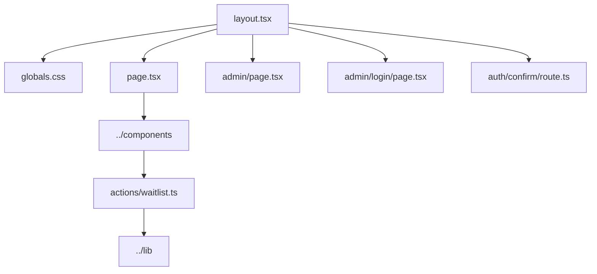

# App Directory

This folder contains the Next.js App Router entry points for FoodLoop.

## Structure

## Files

| File | Purpose |
| --- | --- |
| [`layout.tsx`](./layout.tsx) | Root HTML shell and page metadata. |
| [`page.tsx`](./page.tsx) | Landing page composition, product sections, visual crops, and form placement. |
| [`globals.css`](./globals.css) | Global styling, responsive layout rules, and local design system classes. |
| [`actions/waitlist.ts`](./actions/waitlist.ts) | Server action for waitlist submissions. |
| [`admin/page.tsx`](./admin/page.tsx) | Protected admin list of received waitlist emails. |
| [`admin/login/page.tsx`](./admin/login/page.tsx) | Supabase magic-link admin sign-in. |
| [`auth/confirm/route.ts`](./auth/confirm/route.ts) | Supabase Auth OTP callback handler. |

## Notes

- Keep server-only work inside `actions/` or other server modules.
- Keep client interactivity in client components under `components/`.
- The current locale is Georgian, so rendered copy should be checked in-browser after edits.
