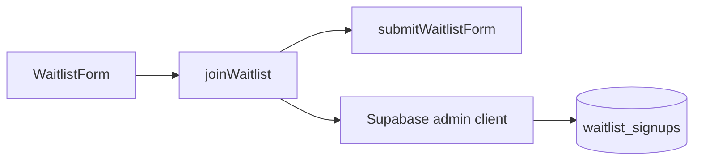

# Server Actions

This folder contains server-side actions that can be called from React forms.

## Waitlist Action

`waitlist.ts` receives `FormData`, delegates validation and result mapping to `lib/waitlist-core.ts`, and inserts valid signups into Supabase with a server-side service role key.

