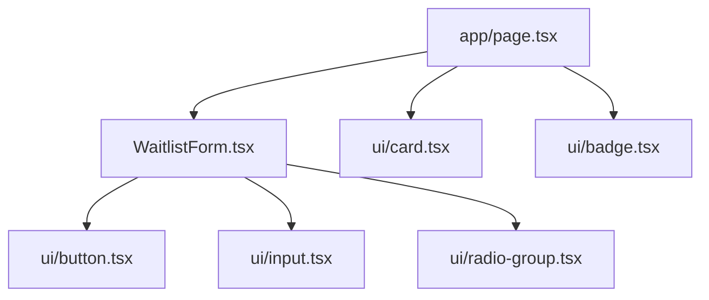

# Components

This folder contains reusable React components for the FoodLoop interface.

## Component Map

## Key Component

[`WaitlistForm.tsx`](./WaitlistForm.tsx) is a client component. It uses `useActionState` for server-action result state and `useFormStatus` for the pending submit button state.

## UI Primitives

The files in [`components/ui`](./ui) are small local primitives used by the landing page. Keep them generic and style them through class names so the page can own layout-specific decisions.

