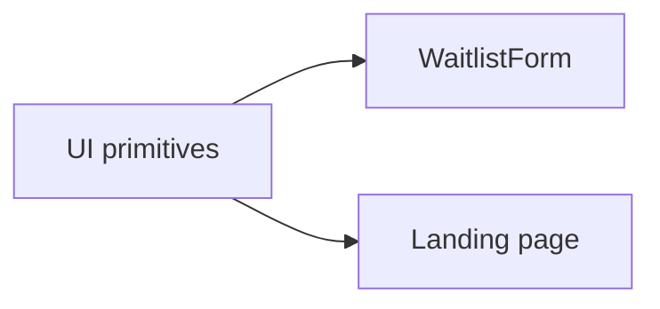

# UI Primitives

These are lightweight reusable UI building blocks used by the landing page.

## Current Set

| Component | Typical Use |
| --- | --- |
| `button.tsx` | Form submit and command buttons. |
| `input.tsx` | Text and email inputs. |
| `radio-group.tsx` | Role selection. |
| `card.tsx` | Offer example cards. |
| `badge.tsx` | Small labels and status chips. |

## Relationship

Keep these components focused on structure and variants. Page-specific layout should remain in `app/globals.css` or the page component.

