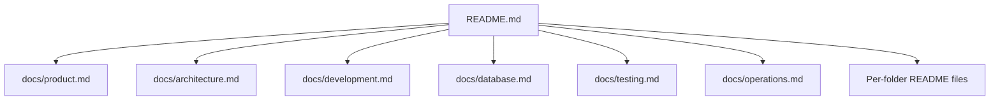

# FoodLoop Documentation

This directory holds cross-cutting documentation that does not belong to one source folder.

## Reading Path

1. [Product Notes](./product.md) explains the product intent and user groups.
2. [Architecture](./architecture.md) shows how the frontend, server action, business logic, and database work together.
3. [Development Guide](./development.md) covers local setup and daily workflow.
4. [Database Guide](./database.md) documents the Supabase schema and security posture.
5. [Testing Guide](./testing.md) describes the current test strategy.
6. [Operations Notes](./operations.md) lists deployment and maintenance checks.

## Documentation Map

