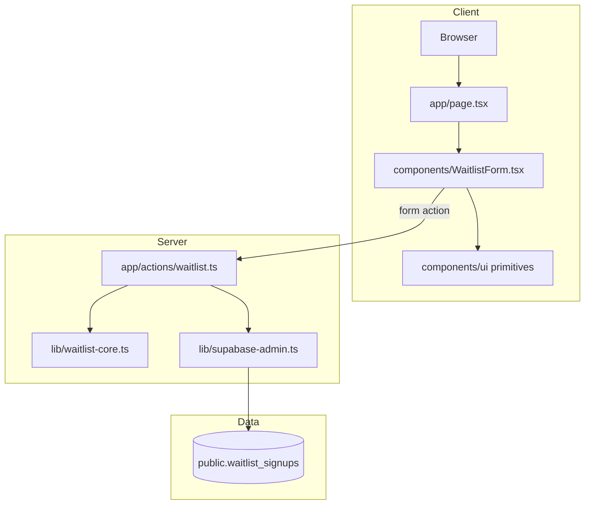
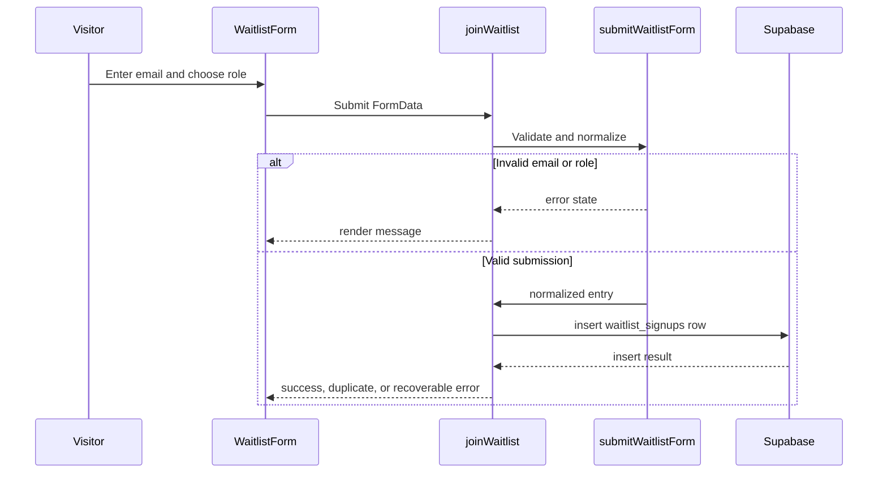
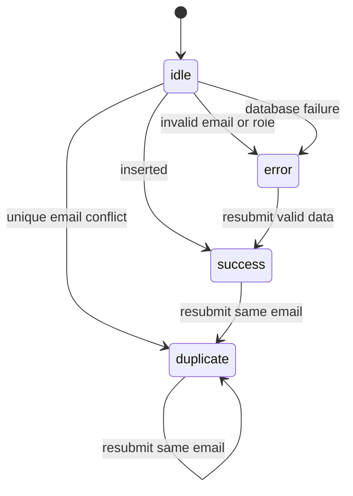
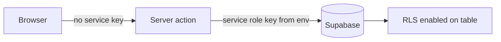

# Architecture

FoodLoop uses Next.js App Router with a small server-action boundary and Supabase as the persistence layer. The most important design choice is keeping waitlist validation in `lib/waitlist-core.ts`, away from React and Supabase, so it can be tested with plain Node tests.

## System Diagram

## Waitlist Submission Sequence

## Source Boundaries

| File | Responsibility |
| --- | --- |
| [`app/page.tsx`](../app/page.tsx) | Landing page composition and product storytelling. |
| [`components/WaitlistForm.tsx`](../components/WaitlistForm.tsx) | Client-side form state, role choice, and submit button pending state. |
| [`app/actions/waitlist.ts`](../app/actions/waitlist.ts) | Server action that connects form submissions to Supabase. |
| [`lib/waitlist-core.ts`](../lib/waitlist-core.ts) | Email normalization, role validation, duplicate mapping, and message-state decisions. |
| [`lib/supabase-admin.ts`](../lib/supabase-admin.ts) | Server-only Supabase admin client creation. |
| [`supabase/migrations/20260517120000_create_waitlist_signups.sql`](../supabase/migrations/20260517120000_create_waitlist_signups.sql) | Waitlist table schema and RLS enablement. |

## State Model

## Security Shape

The browser never receives the Supabase service role key. Form submissions go through a Next.js server action, which creates the Supabase client server-side and inserts into a table with row-level security enabled.

