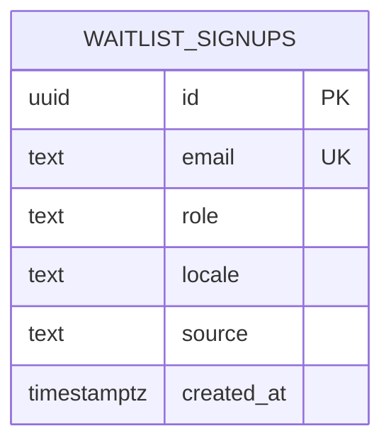
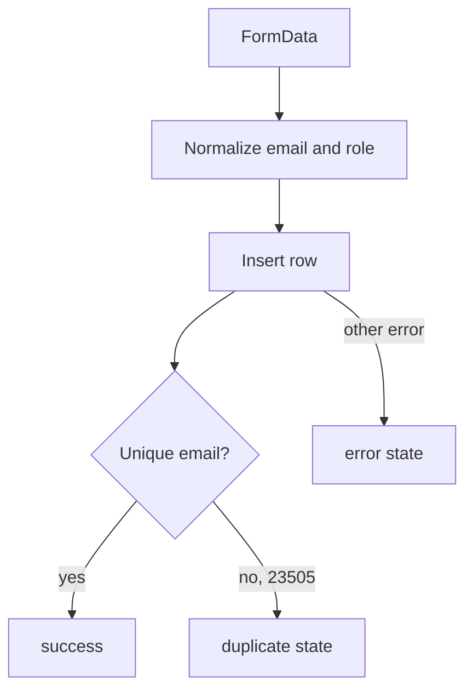

# Database Guide

The database currently contains one product table: `public.waitlist_signups`.

## Entity Diagram

## Table Definition

The migration in [`supabase/migrations/20260517120000_create_waitlist_signups.sql`](../supabase/migrations/20260517120000_create_waitlist_signups.sql) creates:

| Column | Type | Notes |
| --- | --- | --- |
| `id` | `uuid` | Primary key, generated with `gen_random_uuid()`. |
| `email` | `text` | Required and unique. |
| `role` | `text` | Required, constrained to `user` or `partner`. |
| `locale` | `text` | Required, defaults to `ka`. |
| `source` | `text` | Required, defaults to `landing`. |
| `created_at` | `timestamptz` | Required, defaults to `now()`. |

## Insert Path

## Security Posture

Row-level security is enabled. The migration intentionally does not add public policies because the browser should not read or mutate waitlist data directly. Inserts are performed through the server action with the Supabase service role key.

## Future Schema Considerations

- Add optional `city` or `neighborhood` once the landing page asks for location.
- Add `utm_source`, `utm_medium`, and `utm_campaign` if campaign attribution becomes important.
- Add a separate partner-intake table when partner onboarding needs business names, addresses, and inventory categories.

