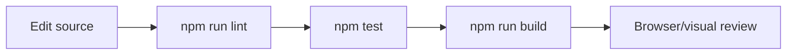

# Development Guide

## Prerequisites

- Node.js compatible with Next.js 16.
- npm.
- A Supabase project when testing real waitlist inserts.

## Local Setup

```bash
npm install
cp .env.example .env.local
npm run dev
```

Add these values to `.env.local`:

```env
NEXT_PUBLIC_SUPABASE_URL=...
SUPABASE_SERVICE_ROLE_KEY=...
```

The service role key is required only on the server side. Do not expose it to client components.

## Daily Workflow



## Common Tasks

| Task | Where to Work |
| --- | --- |
| Change landing copy or section order | [`app/page.tsx`](../app/page.tsx) |
| Change layout, color, spacing, or responsive behavior | [`app/globals.css`](../app/globals.css) |
| Change form controls or pending state | [`components/WaitlistForm.tsx`](../components/WaitlistForm.tsx) |
| Change validation or duplicate behavior | [`lib/waitlist-core.ts`](../lib/waitlist-core.ts) and [`tests/waitlist-core.test.ts`](../tests/waitlist-core.test.ts) |
| Change database fields | [`supabase/migrations`](../supabase/migrations) and the waitlist insert types |

## Encoding Note

The app uses Georgian copy. Keep files saved as UTF-8 and review rendered pages in the browser after changing localized strings.

