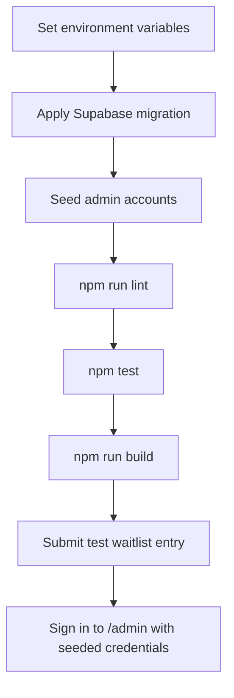

# Operations Notes

## Required Environment

| Variable | Runtime | Purpose |
| --- | --- | --- |
| `NEXT_PUBLIC_SUPABASE_URL` | Client and server | Supabase project URL. Safe to expose. |
| `NEXT_PUBLIC_SUPABASE_PUBLISHABLE_KEY` | Client and server | Supabase publishable key used for Auth session handling. |
| `SUPABASE_SERVICE_ROLE_KEY` | Server only | Inserts waitlist entries and seeds admin Auth users. Keep private. |
| `ADMIN_EMAILS` | Server only | Comma-separated allowlist of admin emails that can view `/admin`. |
| `ADMIN_PASSWORD` | Server only | Preset password used by the admin seeding script. Keep private. |

## Admin Auth Setup

Enable email/password sign-in in Supabase Auth. Then configure:

```env
ADMIN_EMAILS=owner@example.com,ops@example.com
ADMIN_PASSWORD=change-this-long-password
```

Create or rotate the Supabase Auth users for every allowlisted admin:

```bash
npm run seed:admins
```

The seed command creates missing users, confirms their emails, and updates passwords for existing users. Rerun it after changing `ADMIN_EMAILS` or rotating `ADMIN_PASSWORD`.

Admins sign in at `/admin/login`. Only signed-in users whose email appears in `ADMIN_EMAILS` can view received waitlist rows.

## Deployment Checklist



## Runtime Risks

| Risk | Symptom | Check |
| --- | --- | --- |
| Missing service role key | Form returns a recoverable Supabase configuration error or admin seeding fails. | Confirm server environment variables. |
| Missing publishable key | Admin login/session handling fails. | Confirm Supabase Auth environment variables. |
| Admin password not seeded | Admin login rejects valid allowlisted email. | Run `npm run seed:admins` after setting `ADMIN_PASSWORD`. |
| Missing admin allowlist | Signed-in admins see a not-authorized state. | Confirm `ADMIN_EMAILS` includes the admin email. |
| Migration not applied | Insert fails because `waitlist_signups` is missing. | Apply migration before deployment. |
| Duplicate signup | User sees a duplicate state, treated as a positive result. | Expected when email already exists. |
| Broken localized text encoding | Georgian copy renders as mojibake. | Confirm files and deployment pipeline preserve UTF-8. |

## Data Handling

Waitlist data contains email addresses. Limit direct table access, avoid exporting data into logs, and prefer aggregate counts when sharing progress updates.

The admin panel displays email addresses and must remain protected by Supabase Auth plus the server-side allowlist. Do not link `/admin` from the public landing page.
