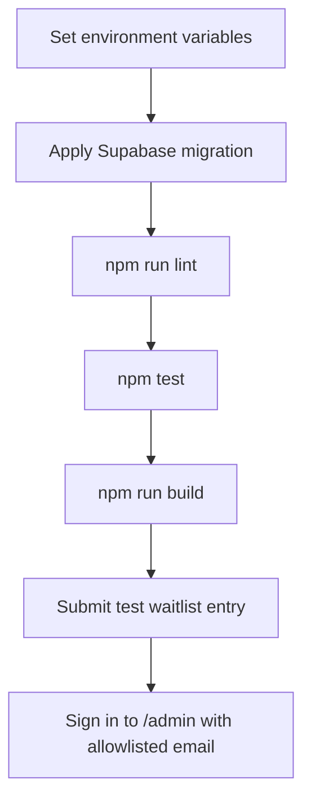

# Operations Notes

## Required Environment

| Variable | Runtime | Purpose |
| --- | --- | --- |
| `NEXT_PUBLIC_SUPABASE_URL` | Client and server | Supabase project URL. Safe to expose. |
| `NEXT_PUBLIC_SUPABASE_PUBLISHABLE_KEY` | Client and server | Supabase publishable key used for Auth session handling. |
| `SUPABASE_SERVICE_ROLE_KEY` | Server only | Inserts waitlist entries from the server action. Keep private. |
| `ADMIN_EMAILS` | Server only | Comma-separated allowlist of admin emails that can view `/admin`. |

## Admin Auth Setup

Configure Supabase Auth magic links for the deployed site URL and callback path:

```text
https://your-domain.example/auth/confirm?token_hash={{ .TokenHash }}&type=email
```

Admins sign in at `/admin/login`. Only emails listed in `ADMIN_EMAILS` can view received waitlist rows.

## Deployment Checklist



## Runtime Risks

| Risk | Symptom | Check |
| --- | --- | --- |
| Missing service role key | Form returns a recoverable Supabase configuration error. | Confirm server environment variables. |
| Missing publishable key | Admin login or auth callback fails. | Confirm Supabase Auth environment variables. |
| Missing admin allowlist | Signed-in admins see a not-authorized state. | Confirm `ADMIN_EMAILS` includes the admin email. |
| Migration not applied | Insert fails because `waitlist_signups` is missing. | Apply migration before deployment. |
| Duplicate signup | User sees a duplicate state, treated as a positive result. | Expected when email already exists. |
| Broken localized text encoding | Georgian copy renders as mojibake. | Confirm files and deployment pipeline preserve UTF-8. |

## Data Handling

Waitlist data contains email addresses. Limit direct table access, avoid exporting data into logs, and prefer aggregate counts when sharing progress updates.

The admin panel displays email addresses and must remain protected by Supabase Auth plus the server-side allowlist. Do not link `/admin` from the public landing page.
