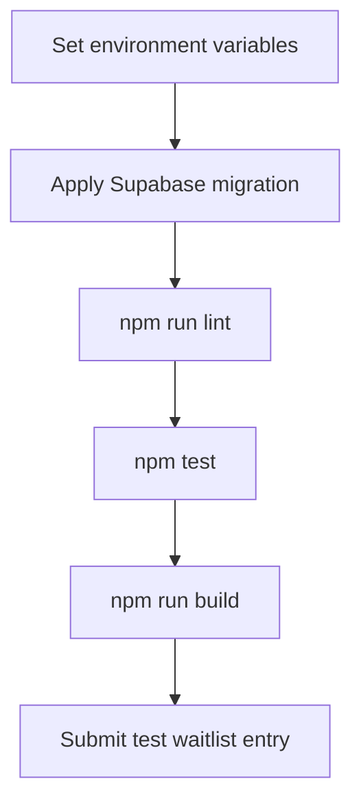

# Operations Notes

## Required Environment

| Variable | Runtime | Purpose |
| --- | --- | --- |
| `NEXT_PUBLIC_SUPABASE_URL` | Client and server | Supabase project URL. Safe to expose. |
| `SUPABASE_SERVICE_ROLE_KEY` | Server only | Inserts waitlist entries from the server action. Keep private. |

## Deployment Checklist

## Runtime Risks

| Risk | Symptom | Check |
| --- | --- | --- |
| Missing service role key | Form returns a recoverable Supabase configuration error. | Confirm server environment variables. |
| Migration not applied | Insert fails because `waitlist_signups` is missing. | Apply migration before deployment. |
| Duplicate signup | User sees a duplicate state, treated as a positive result. | Expected when email already exists. |
| Broken localized text encoding | Georgian copy renders as mojibake. | Confirm files and deployment pipeline preserve UTF-8. |

## Data Handling

Waitlist data contains email addresses. Limit direct table access, avoid exporting data into logs, and prefer aggregate counts when sharing progress updates.

