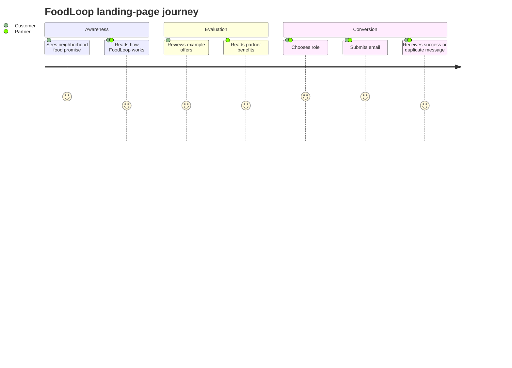

# Product Notes

FoodLoop is positioned as a neighborhood marketplace for affordable meals and lower food waste. The current release is a polished landing page whose job is to validate interest from two groups before the full marketplace exists.

## Audience

| Audience | Need | Current App Response |
| --- | --- | --- |
| Customers | Discover affordable daily food offers nearby. | Georgian-language narrative, offer examples, and a customer waitlist role. |
| Partners | Reach nearby buyers for surplus or daily prepared food. | Partner section, business-oriented copy, and a partner waitlist role. |
| Operators | Collect clean early demand signals. | Supabase waitlist table with role, locale, source, and timestamp. |

## Experience Flow

## Product Boundaries

In scope:

- Landing-page storytelling.
- Customer and partner waitlist capture.
- Duplicate email handling.
- Georgian locale metadata.

Out of scope for the current codebase:

- Public offer inventory.
- Customer accounts.
- Partner dashboards.
- Payments, pickup windows, or notifications.

