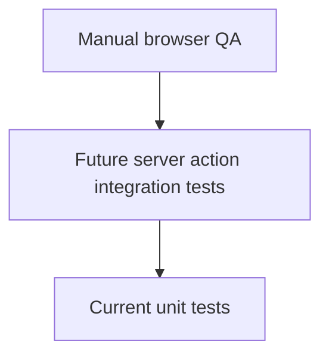
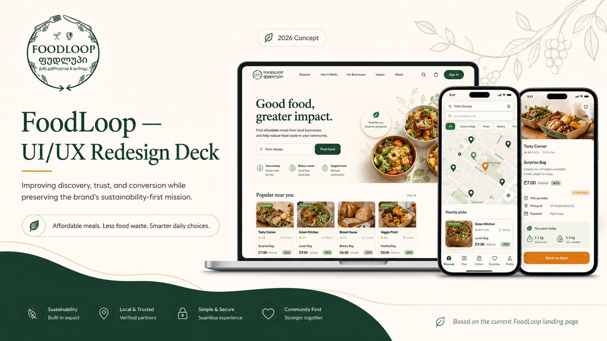

# Testing Guide

The current test suite focuses on shared email validation, the waitlist core, and admin authorization helpers because that is where the highest-risk branching lives: validation, normalization, duplicate handling, recoverable database failures, and email allowlist checks.

## Test Pyramid



## Current Coverage

[`tests/waitlist-core.test.ts`](../tests/waitlist-core.test.ts) verifies:

- Email trimming and lowercasing.
- Customer role insert payload.
- Partner role success behavior.
- Invalid email rejection before insert.
- Invalid role rejection before insert.
- Duplicate email mapping from Supabase code `23505`.
- Recoverable insert errors.
- Recoverable thrown client errors.

[`tests/admin-auth.test.ts`](../tests/admin-auth.test.ts) verifies:

- Comma-separated admin email parsing.
- Whitespace trimming and case normalization.
- Rejection of missing or non-allowlisted emails.

[`tests/email.test.ts`](../tests/email.test.ts) verifies:

- Shared email normalization.
- Basic email shape validation.

## Commands

```bash
npm run lint
npm run typecheck
npm test
npm run check:copy
npm run build
```

## Visual QA

The repo includes visual source assets that are useful when checking layout direction:

| Concept Frame | Market Sheet |
| --- | --- |
|  |  |

Use these as a baseline after layout, copy, or image-cropping changes. If browser QA screenshots are generated later, store them in a stable folder and link them from this section.
