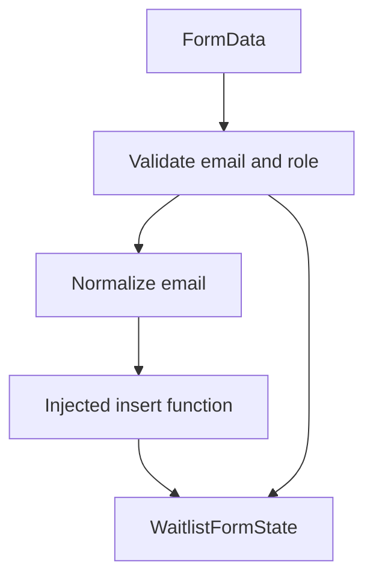

# Lib

This folder contains shared application logic that should stay independent from page layout.

## Modules

| File | Purpose |
| --- | --- |
| [`waitlist-core.ts`](./waitlist-core.ts) | Pure waitlist validation, normalization, insert orchestration, and result-state mapping. |
| [`supabase-admin.ts`](./supabase-admin.ts) | Server-side Supabase admin client factory. |
| [`utils.ts`](./utils.ts) | Shared utility helpers. |

## Waitlist Core Boundary

`submitWaitlistForm` receives an insert function instead of importing Supabase directly. This keeps the logic testable and makes failure modes easy to simulate.

