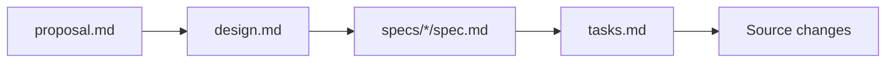

# OpenSpec

This folder contains change proposals, specs, design notes, and task plans used to shape FoodLoop.

## Change Workflow

## Current Changes

| Change | Purpose |
| --- | --- |
| [`build-foodloop-landing-waitlist`](./changes/build-foodloop-landing-waitlist) | Initial landing page and waitlist capture scope. |
| [`redesign-neighborhood-table-landing`](./changes/redesign-neighborhood-table-landing) | Visual redesign direction and neighborhood table concept. |

Use these files as product intent references when making future UX, copy, or behavior changes.

