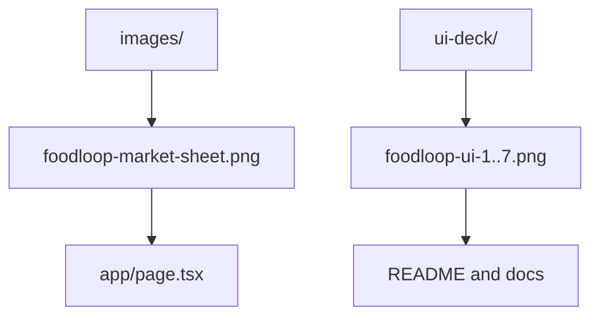

# Public Assets

This folder contains static assets served by Next.js.

## Asset Map

## Current Assets

- [`images/foodloop-market-sheet.png`](./images/foodloop-market-sheet.png) is the main landing-page source image.
- [`ui-deck/`](./ui-deck) contains concept/reference frames for visual direction.

When replacing assets, keep filenames stable unless you also update `app/page.tsx` and any documentation references.

