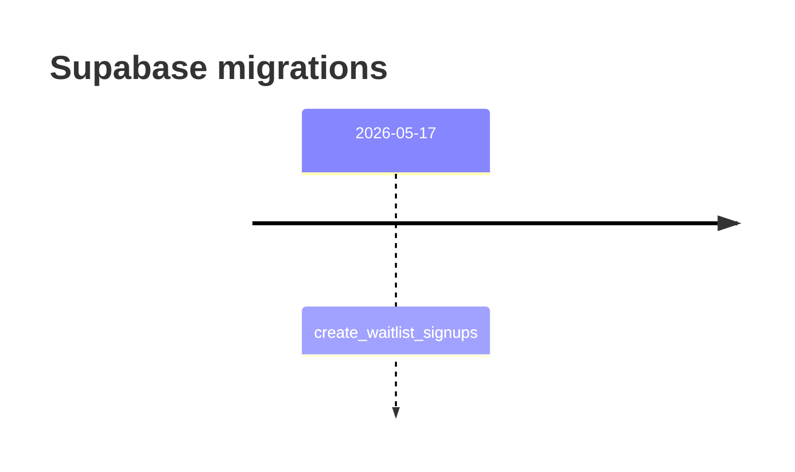

# Supabase

This folder contains database migrations for the Supabase project.

## Migration Timeline

## Current Schema

The first migration creates `public.waitlist_signups` with:

- Unique email addresses.
- A constrained role of `user` or `partner`.
- Locale and source metadata.
- Row-level security enabled.

See [Database Guide](../docs/database.md) for the full diagram and column notes.

