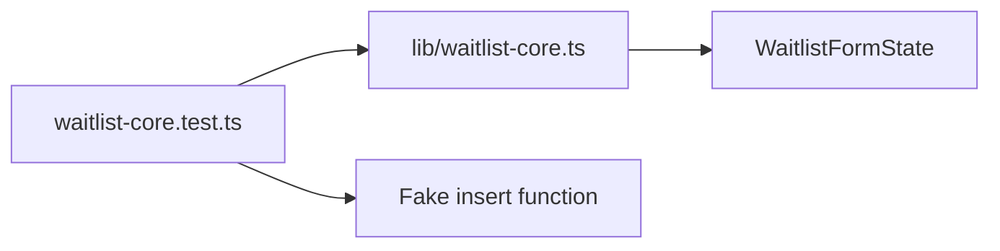

# Tests

The test suite currently targets the waitlist business logic in `lib/waitlist-core.ts`.

## Test Flow



## Running Tests

```bash
npm test
```

The tests use Node's built-in test runner through `tsx`, so TypeScript test files can run without a separate compile step.

