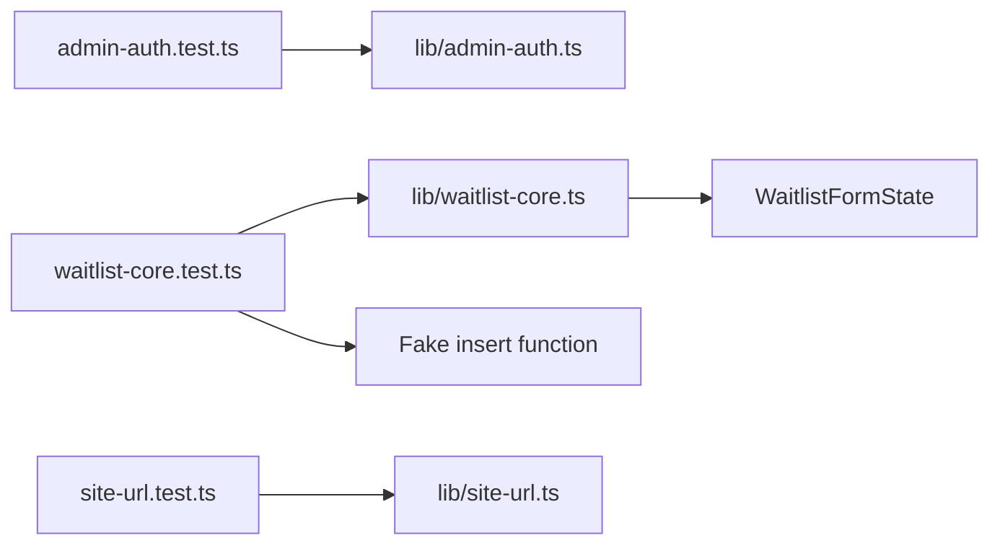

# Tests

The test suite targets framework-light business logic in `lib/`, including waitlist validation, admin authorization, and canonical site URL handling.

## Test Flow



## Running Tests

```bash
npm test
```

The tests use Node's built-in test runner through `tsx`, so TypeScript test files can run without a separate compile step.
